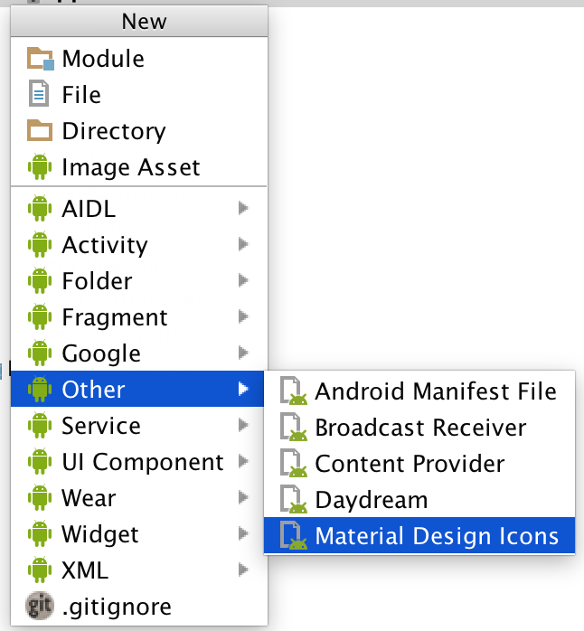
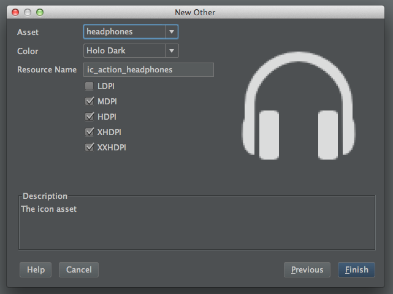

Androidicons ADT Template
=========================

Android Studio / Eclipse ADT template for including icon resources from [androidicons.com](http://www.androidicons.com/) in your project.

Setup
-----

1. Purchase and download [Androidicons](http://www.androidicons.com/)
2. Clone or extract the contents of this repo into your IDE templates folder:
   - Android Studio: `<android-studio-folder>/plugins/android/lib/templates/other`
   - Eclipse: `<android-sdk-folder>/extras/templates/other`
3. Place your Androidicons assets folder inside `AndroidIcons/root`

Usage
-----

- Android Studio: Right click on your application module and select **New > Other > Android Icons**
- Eclispe: Right click on your project and select **New > Other... > Android > Android Object > Android Icons**

License
-------

    Copyright 2014 readyState Software Limited

    Licensed under the Apache License, Version 2.0 (the "License");
    you may not use this file except in compliance with the License.
    You may obtain a copy of the License at

       http://www.apache.org/licenses/LICENSE-2.0

    Unless required by applicable law or agreed to in writing, software
    distributed under the License is distributed on an "AS IS" BASIS,
    WITHOUT WARRANTIES OR CONDITIONS OF ANY KIND, either express or implied.
    See the License for the specific language governing permissions and
    limitations under the License.
